<!-- Profile Header with Typing Animation -->
<div align="center">
  <a href="https://git.io/typing-svg">
    
  </a>
</div>

<!-- Animated Divider -->


<!-- Profile Views & Location Badge -->
<div align="center">
  
  &nbsp;
  
  &nbsp;
  
</div>

<br>

<!-- About Me Section -->
##  About Me

```javascript
const yousuf = {
  role: "Backend JavaScript Developer",
  location: "Karachi, Pakistan 📍",
  experience: "7+ years",
  education: "BS Computer Science 🎓",
  passion: ["Building scalable APIs", "Clean Architecture", "Open Source"],
  currentlyLearning: "Cloud Native Technologies ☁️",
  funFact: "I debug with console.log and I'm not ashamed! 😄"
};
```

> 💼 **Leading web application development** at a reputable firm, crafting robust solutions with modern JavaScript ecosystems.

<!-- Tech Stack Section -->
## 🛠️ Tech Stack

### Backend & Runtime
<p align="left">
  
  
  
  
</p>

### Frontend
<p align="left">
  
  
  
  
  
</p>

### Databases
<p align="left">
  
  
  
  
</p>

### DevOps & Tools
<p align="left">
  
  
  
  
  
</p>

<!-- Skill Icons Grid (Alternative Visual) -->
<details>
  <summary>🎯 <b>Click to see skill icons grid</b></summary>
  <br>
  <p align="center">
    
  </p>
</details>

<!-- GitHub Stats Section -->
## 📊 GitHub Analytics

<div align="center">
  <!--  -->
  
</div>

<br>

<!-- <div align="center">
  
  
</div> -->

<!-- GitHub Activity Graph -->
## 🔥 Contribution Graph

<div align="center">
  
</div>

### GitHub Stats

<p align="center" >  </p>

## 🏆 Profile Trophies & Stats

<div align="center">
  
</div>

<!-- <div align="center">
  
  
</div>

<div align="center">
  
</div>
<!-- Featured Projects Section -->
## 🚀 Featured Projects -->

<div align="center">
  <a href="https://github.com/youxufkhan">
    
  </a>
</div>

<!-- Connect With Me Section -->
## 🤝 Let's Connect

<div align="center">
  <a href="mailto:m.youxuf@gmail.com" target="_blank">
    
  </a>
  &nbsp;
  <a href="https://www.linkedin.com/in/yousufiqbalkhan/" target="_blank">
    
  </a>
  &nbsp;
  <a href="https://www.github.com/youxufkhan" target="_blank">
    
  </a>
  &nbsp;
  <a href="https://www.stackoverflow.com/users/9066939/yousuf-khan" target="_blank">
    
  </a>
</div>

<br>

<!-- Random Dev Quote -->
<div align="center">
  
</div>

<!-- Footer -->
<br>
<div align="center">
  <a href="https://u8views.com/github/youxufkhan"></a>
  
  
</div>


<!-- Snake Animation (Optional - Requires GitHub Action Setup) -->
<!--
<picture>
  <source media="(prefers-color-scheme: dark)" srcset="https://raw.githubusercontent.com/youxufkhan/youxufkhan/output/github-contribution-grid-snake-dark.svg">
  <source media="(prefers-color-scheme: light)" srcset="https://raw.githubusercontent.com/youxufkhan/youxufkhan/output/github-contribution-grid-snake.svg">
  
</picture>
-->

<!--
🐍 To enable the snake animation, create a GitHub Action workflow file at:
.github/workflows/snake.yml

With the following content:

name: Generate Snake Animation

on:
  schedule:
    - cron: "0 0 * * *"
  workflow_dispatch:

jobs:
  generate:
    runs-on: ubuntu-latest
    steps:
      - uses: Platane/snk/svg-only@v3
        with:
          github_user_name: youxufkhan
          outputs: |
            dist/github-contribution-grid-snake.svg
            dist/github-contribution-grid-snake-dark.svg?palette=github-dark
      - uses: crazy-max/ghaction-github-pages@v3
        with:
          target_branch: output
          build_dir: dist
        env:
          GITHUB_TOKEN: ${{ secrets.GITHUB_TOKEN }}
-->
